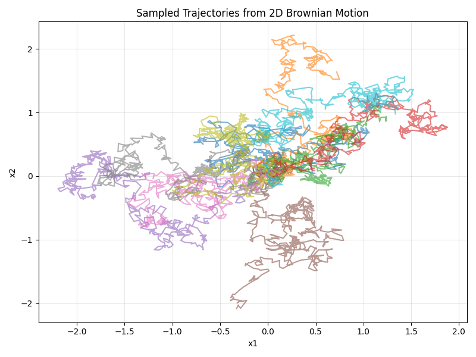
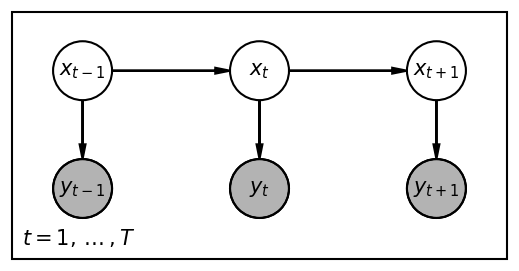

# linsdex

`linsdex` is a high performance JAX-based library for linear stochastic differential equations (SDEs), state-space models, and Gaussian inference. It provides a modular and extensible framework for defining, simulating, and conditioning linear-Gaussian systems with support for parallelized inference on GPUs.

## Quick Start

Define an SDE, condition it on a starting point, and sample trajectories in parallel using JAX.

```python
import jax
import jax.numpy as jnp
from linsdex import BrownianMotion

# 1. Define a 2D Brownian Motion SDE
sde = BrownianMotion(sigma=1.0, dim=2)

# 2. Condition on starting at the origin at t=0
conditioned_sde = sde.condition_on_starting_point(t0=0.0, x0=jnp.zeros(2))

# 3. Sample 100 trajectories in parallel on a time grid
key = jax.random.PRNGKey(0)
keys = jax.random.split(key, 100)
times = jnp.linspace(0.0, 1.0, 500)

# Use jax.vmap for efficient batch sampling
trajectories = jax.vmap(conditioned_sde.sample, in_axes=(0, None))(keys, times)
```



## Key Features

The library focuses on high performance and numerical stability.

*   **Linear SDEs**: Comprehensive support for linear time-invariant (LTI) and time-varying SDEs with exact transition distributions.
*   **Efficient Inference**: Sequential and parallel message passing (parallel scan) for filtering, smoothing, and sampling in chain-structured Gaussian CRFs.
*   **Probabilistic Primitives**: Multiple Gaussian parameterizations (Standard, Natural, Mixed) with numerically stable operations.
*   **Specialized Linear Algebra**: A custom matrix library with Diagonal, Block, and Dense types that leverage symbolic tags for optimization.
*   **Diffusion Utilities**: Unified interface for mapping between clean data predictions, scores, and probability flow for generative modeling.
*   **JAX-Native**: Fully compatible with `jax.vmap`, `jax.grad`, and `jax.jit` for automatic vectorization and differentiation.

## Stochastic Harmonic Oscillator

This example demonstrates how to perform inference in a State Space Model where the latent dynamics are governed by a Linear Stochastic Differential Equation. By conditioning a base SDE on noisy observations, `linsdex` constructs a Gaussian Conditional Random Field. We then use parallel message passing to compute the posterior $p(x_{1:T} | y_{1:T})$, which allows us to draw samples that interpolate the data while respecting the underlying physical laws of the oscillator.

The latent state $x_t \in \mathbb{R}^2$ represents the position and velocity of a stochastic harmonic oscillator. Its evolution is described by the linear SDE

$$ dx_t = F x_t dt + L dW_t $$

where $F = \begin{bmatrix} 0 & 1 \\ -\omega^2 & -\gamma \end{bmatrix}$ defines the deterministic drift and $L$ defines the diffusion. The library automatically computes the exact transition distribution $p(x_t | x_{t-1})$ by solving the Lyapunov equation over the time interval $\Delta t$.

We observe the position $y_t \in \mathbb{R}^1$ through a noisy channel

$$ p(y_t | x_t) = \mathcal{N}(y_t, H x_t, \sigma^2 I) $$

In our example, the encoder `PaddingLatentVariableEncoderWithPrior` specifies $H = [1, 0]$. This means we only observe the first component of the latent state with Gaussian noise $\sigma$.

The model can be represented as a chain structured graphical model where $x_t$ are latent variables and $y_t$ are noisy observations.



```python
import jax
import jax.numpy as jnp
import jax.random as random
import matplotlib.pyplot as plt
from linsdex import TimeSeries, StochasticHarmonicOscillator
from linsdex.ssm.simple_encoder import PaddingLatentVariableEncoderWithPrior

# 1. Define time series data
# We create sparse 1D data for interpolation
times = jnp.linspace(0, 10, 5)
values = jnp.sin(times)[:, None]
series = TimeSeries(times, values)

# 2. Define a linear SDE (base process)
# We use a Stochastic Harmonic Oscillator which has a 2D state (1D position, 1D velocity)
sde = StochasticHarmonicOscillator(
    freq=1.0,
    coeff=0.1,
    sigma=0.5,
    observation_dim=1
)

# 3. Create potentials from data and condition the SDE
# PaddingLatentVariableEncoderWithPrior pads the 1D observations to the 2D latent space
encoder = PaddingLatentVariableEncoderWithPrior(
    y_dim=1,
    x_dim=2,
    sigma=0.01
)
potentials = encoder(series)
conditioned_sde = sde.condition_on(potentials)

# 4. Draw samples from the posterior
key = random.PRNGKey(0)
keys = random.split(key, 128)

# Interpolate on a denser time grid
save_times = jnp.linspace(0, 10, 2000)
samples: TimeSeries = jax.vmap(conditioned_sde.sample, in_axes=(0, None))(keys, save_times)

# 5. Plot the original time series and the posterior samples
fig, axes = samples.plot(show_plot=False)
plt.savefig("quick_start.png")
```


## Core Components

The library provides several layers of abstraction for probabilistic modeling.

### Stochastic Differential Equations

The library defines a hierarchy of SDEs starting from `AbstractSDE`.

Linear Time-Invariant (LTI) SDEs are models where the drift and diffusion coefficients are constant over time. Examples include `BrownianMotion`, `OrnsteinUhlenbeck`, and `StochasticHarmonicOscillator`.

Linear SDEs are models with time-varying coefficients, such as `VariancePreserving` SDEs used in diffusion models.

Conditioned SDEs allow for conditioning a process on any number of Gaussian potentials using `ConditionedLinearSDE`.

#### Diffusion Conversions

`linsdex` provides a unified interface for working with different mathematical representations of a diffusion process. They allow for mapping between neural network predictions (such as the clean data $y_1$) and quantities required for sampling (such as the probability flow or the drift of an SDE).

The `DiffusionModelComponents` class encapsulates the objects that define a diffusion process, including the base linear SDE, the prior distribution at $t_0$, and the evidence covariance at $t_1$.

```python
from jaxtyping import Array, Float
from linsdex.diffusion_model.diffusion_conversion import DiffusionModelComponents
from linsdex import BrownianMotion, StandardGaussian, DiagonalMatrix

dim: int = 10
sde = BrownianMotion(sigma=0.1, dim=dim)
xt0_prior = StandardGaussian(jnp.zeros(dim), DiagonalMatrix.eye(dim))
evidence_cov = DiagonalMatrix.eye(dim) * 0.001

components = DiffusionModelComponents(
    linear_sde=sde,
    t0=0.0,
    x_t0_prior=xt0_prior,
    t1=1.0,
    evidence_cov=evidence_cov
)
```

The `DiffusionModelConversions` class maps between different parameterizations of the diffusion path, such as converting a prediction into the score function, probability flow, or drift.

```python
from jaxtyping import Array, Float
from linsdex.diffusion_model.diffusion_conversion import DiffusionModelConversions

conversions = DiffusionModelConversions(components, t=0.5)

# Map clean data prediction y1 to different sampling quantities
flow: Float[Array, "dim"] = conversions.y1_to_flow(y1_pred, xt)
drift: Float[Array, "dim"] = conversions.y1_to_drift(y1_pred, xt)
score: Float[Array, "dim"] = conversions.y1_to_score(xt, y1_pred)
```

The `DiffusionPathQuantities` class can be used to compute and cache time-dependent intermediate quantities, avoiding redundant computations when performing multiple conversions at the same time step. Additionally, `noise_schedule_drift_correction` allows for adjusting the drift when a different noise schedule is used at inference time compared to training.

### Gaussian Potentials

`linsdex` implements Gaussians in three forms to ensure stability across different operations.

`StandardGaussian` uses mean ($\mu$) and covariance ($\Sigma$) parameters. This form is best for sampling and interpreting results.

`NaturalGaussian` uses precision-mean ($h$) and precision ($J$) parameters. This form is best for multiplying densities and message passing.

`MixedGaussian` uses mean ($\mu$) and precision ($J$) parameters. It provides a stable bridge between standard and natural forms, which is particularly useful for Kalman filtering steps.

### Conditional Random Fields (CRF)

The `CRF` class represents a chain-structured probabilistic model. It serves as the engine for discrete-time inference.

```python
from jaxtyping import Array, Float, PRNGKeyArray
from linsdex import CRF, AbstractPotential

# Create a CRF from node potentials and transitions
crf = CRF(node_potentials, transitions)

# Perform inference
messages: AbstractPotential = crf.get_forward_messages() # Forward pass
marginals: AbstractPotential = crf.get_marginals() # p(x_t | observations)
samples: Float[Array, "T D"] = crf.sample(key) # Draw joint samples
```

For long sequences, `linsdex` uses a parallel scan implementation of message passing to provide $O(\log T)$ complexity on parallel hardware.

### Specialized Matrix Library

To handle structured models efficiently, `linsdex` includes a matrix library that avoids expensive dense operations when possible.

`DiagonalMatrix` is used for decoupled systems or independent noise.

`Block2x2Matrix` and `Block3x3Matrix` are optimized for higher-order tracking models.

Matrices carry symbolic tags like `TAGS.zero_tags` and `TAGS.eye_tags`. These tags allow the library to symbolically simplify expressions like $0 \times A$ or $I \times B$ before they reach JAX.

## Installation

```bash
pip install .
```

## Citation

If you use `linsdex` in your research, please cite the following software.

```bibtex
@software{cunningham2025linsdex,
  author       = {Cunningham, Edmond},
  title        = {{linsdex}: A High-Performance JAX-based Library for Linear Stochastic Differential Equations},
  version      = {0.1.0},
  url          = {https://github.com/EddieCunningham/linsdex},
  note         = {Python package},
}
```
